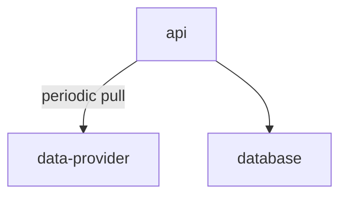

# Introduction

This is the MVP for the [Monte-Carlo](https://www.montecarlodata.com/) home assignment.

# How to run?

## Prerequisites

- [docker](https://www.docker.com/)
- docker-compose (it comes with the installation of docker desktop)
- make
- [Postman](https://www.postman.com/downloads/)
- (optional) [python 3.9+](https://www.python.org/downloads/)
- (optional) [python virtual environment](https://docs.python.org/3/library/venv.html)
- (optional) [VSCode](https://code.visualstudio.com/)
- (optional) [VSCode Remote Extension](https://marketplace.visualstudio.com/items?itemName=ms-vscode-remote.vscode-remote-extensionpack)

If you only run the service to see how it works, then you don't need to install those optional components. 

## Get the code
open a terminal, then type in the following commands

```
# create a temporary folder to hold the code, please feel free to choose a proper folder name.
mkdir ~/mywork
cd ~/mywork
git clone https://github.com/yuanbing/mc-tha.git
cd mc-tha
```

## Run the service

```
# assume you're in the same folder where the source code is checked out to

# build the containers, patient...
make build

# start the service
make run
```

For the first time, it will take some time for downloading and building the docker images. 

If everything goes fine, you should see something like this in the terminal.

```
...
[+] Running 2/2
 ⠿ Network pricesapi_default  Created                                                                                                                     0.1s
 ⠿ Container pricesapi-api-1  Started                                                                                                                     0.6s
...
```

You could tail the log output of the running container:

```
make logs
```

## Sanity check
After making sure the service is up and running, it's time to run a simple sanity check:

```
make test
WARN[0000] Found orphan containers ([queryapi-vscode-1]) for this project. If you removed or renamed this service in your compose file, you can run this command with the --remove-orphans flag to clean it up.
===================================================================== test session starts =====================================================================
platform linux -- Python 3.9.15, pytest-7.2.0, pluggy-1.0.0
rootdir: /workspace
plugins: cov-4.0.0, anyio-3.6.2
collected 1 item

tests/test_app.py .                                                                                                                                     [100%]

====================================================================== 1 passed in 0.10s ======================================================================

```

## Functional tests
The above sanity check proves whether the container(s) are running properly. But it won't tell whether the service is working accordingly. For that we need to run the function tests. This time we would use [postman](https://www.postman.com/downloads/) to run the test suite.

- Launch postman
- Import [test suite](https://drive.google.com/file/d/17VOWY5x66-4j287ew8LefurHM8FGgbO7/view?usp=share_link)
- In postman, you could execute the tests:
	- collect the price data (from the provider) by executing the collection actions (5 in total)
	- wait for a while (10 - 15) minutes, the collection interval is set to 1 minute. You could see the data collection from the logging output.
	- get the latest price for *btcusd*
	- get the volatility rank

screenshot:


## Shutdown the service

```
# in the same folder where you start the service
make shutdown
```

# Service API

The service provides a *RESTful* like API that doesn't follow the *REST* canon by the book, more discussions on that later.

The API supports

- collecting the exchange rate of a crypto currency;
- getting the latest exchange rate of a crypto currency;
- getting the volatility rank of a set of crypto currencies.

## API: collect the exchange rate

It asks the service to start collecting the exchange rate for a particular crypto currency.

 API | Detail
------------- | -------------
entry point  | `prices/collect`
HTTP method  | PUT
input 	| `{"exchange": "binance-us", "pair": "btcusd"}`
output | `"scheduled"` if succeeded or some error message if failed

*Note:* for the MVP, we *ONLY* support getting the exchange rate for a fixed exchange. It's my understanding that there are multiple exchanges and the exchange rate could vary for the same pair of crypto currency and concrete currency.

## API: get the latest exchange rate

It provides the latest exchange rate for a crypto currency whose rate is being collected. In other words, one *MUST* use the above API to collect the exchange rate first.

 
 API | Detail
------------- | -------------
entry point  | `prices/binance-us/{name_of_crypto_currency}/price`
HTTP method  | GET
input	| None
output | exchange rate (e.g.16854.97) or -1.0 (if the data is not collected)

## API: get the volatility rank

It rank the volatility for a set of crypto currencies. The rank is determined by reverse sorting the standard deviation of the exchange rate for the last *24* hours. If there is *no* data collected for a particular crypto currency, then its rank is *-1*.

 API | Detail
------------- | -------------
entry point  | `prices/rank`
HTTP method  | POST
input 	| `{"exchange": "binance-us","pairs": ["ethusd","btcusd",...]}`
output | `[{"pair":"btcusd","stdev":1.4990663761147605,"rank": 1},{"pair": "ethusd","stdev":0.28991378028654236,"rank": 2},...]}`

# Technical details

## Design


### Components

The service is composed of three components: *api*, *database* and *data provider*. The *data provider* is considered as the *external* dependency that we have no control over. Thus our discussion is mainly focused on *api* and *database*.

Since the *api* component is influenced by the [requirement](https://drive.google.com/file/d/1Z9WAjceg8AjuhaF94mqjN-yyaLmPkWfU/view?usp=sharing) and influences the *database* component, thus we start our discussion with *api* component.

#### component: api

The *api* component has three sub-components:
- api/service entry points

this is the client facing interface that meets the [requirements](https://drive.google.com/file/d/1Z9WAjceg8AjuhaF94mqjN-yyaLmPkWfU/view?usp=sharing). 
	- it's implemented in [app.py](https://github.com/yuanbing/mc-tha/blob/8d186dcc27ce67bbbeb398a50b80766640abd06c/src/api/app.py)
	- it uses [FastAPI](https://fastapi.tiangolo.com/) to provide the foundation for a *RESTful* service
	- it uses the ingest and data_access components to process the business logic according to the [requirement](https://drive.google.com/file/d/1Z9WAjceg8AjuhaF94mqjN-yyaLmPkWfU/view?usp=sharing).
	
- ingest

The ingest is responsible for:
	- collecting the exchange rate from the *data provider* for a particular crypto currencyminute*
	- parsing the response from the *data provider* into [DataItem](https://github.com/yuanbing/mc-tha/blob/8d186dcc27ce67bbbeb398a50b80766640abd06c/src/model/item.py) and appending to database

The collection [task](https://github.com/yuanbing/mc-tha/blob/8d186dcc27ce67bbbeb398a50b80766640abd06c/src/ingest/task.py) runs on *1 minute* interval. And there is *one* collection task per crypto currency.
	
- data_access
The data access is responsible for:
	- append/write to the DB table. the data in the table is sorted ascendingly by the time stamp;
	- read from the DB table to:
		- get the latest exchange rate for the specified crypto currency;
		- calculate the standard deviation of the crypto currency for the last *24* hours.

The data access is implemented in [data_access.py](https://github.com/yuanbing/mc-tha/blob/8d186dcc27ce67bbbeb398a50b80766640abd06c/src/db/data_access.py).
	

#### component: database

This is one *logic" table per crypto currency whose the exchange rate being collected. The collected exchange rate may well be put into one uber table. The database should be tailored towards handling time series data. Unfortunately though, I'm not familiar with the python usage of any DB. In the past, I totally rely on the *provided* DB service.

So in the end I've decided to implement my own [in-memory DB](https://github.com/yuanbing/mc-tha/blob/8d186dcc27ce67bbbeb398a50b80766640abd06c/src/db/in_memory_db.py).
	
In essence, the aforementioned *logic" table is implemented as a [*bounded deque*](https://github.com/yuanbing/mc-tha/blob/8d186dcc27ce67bbbeb398a50b80766640abd06c/src/db/in_memory_db.py#L31). The bound is set to be the maximum number of [DataItem](https://github.com/yuanbing/mc-tha/blob/8d186dcc27ce67bbbeb398a50b80766640abd06c/src/model/item.py). Because there is *one* item per minute. And we're only interested in the data for the last *24* hours. In other words, we only need to store up to 1440(24*60) items. In this regard, the dequre wors, more or less, like a sliding window of length 1440.
	

## Future work
This current implemention is merely a MVP, far from production ready. To be production ready, we need several improvements:
	
### the api
The current API is hardly *RESTful*: frankly speaking, it is NOT at all. For the production deployment, we might want to move towards RPC based api that is more inline with the requirement.
	
### ingest

The ingestion component can be improved:
- separate into a dedicated data pipeline. This pipeline can be driven by a chronous like service that triggers the ingestion on a fixed yet configurable interval;
- currently there is one task per pair of exchange/crypto currency. Each task runs in its thread, this is *unbounded*! Since we are downloading data from the same provider, this is *NOT* efficient and may well be rated limited by the provider. For that we could:
	- batch the pairs (of exchange/crypto currency);
	- use connection pool (to *data provider*) to avoid rate limiting;
	- use client side rate limiting to further reduce the possibility of being rate limited.

### database

As I've mentioned earlier, I've cheated by using my own in-memory DB. It may be Okay for MVP, but definitely *NOT* for production. To be production ready, we should use a matured time series DB with good python support. [TimeScale](https://www.timescale.com/) may be such a choice.
	
### tests

The MVP serverly lacks tests, and don't even mention code coverage. Before we could claim production ready, we need add more unit, as well as regression and integration tests.

### logging and ODS stats

Currently the MVP is aslo lacking logging and ODS stats supports. From my past experience, the *well-formed* logging proves to be amongst the most effective way of mornitoring the service. A good choice of such *well-formed* format might be *standarized" JSON format. By *standarized", I mean the JSON message contains pre-defined fields so that the logging entry could be easily consumed by downstream tools like JQ in order to extract useful information such as response status and etc.

On the other hand, the ODS stats, such as error rate and etc, in addition to the normal set of stats like CPU, memory usage etc, shall be collected and published or aggregated to the serivce like prometheus. Normally these stats can be used as signals to alarms should something goes wrong. 
